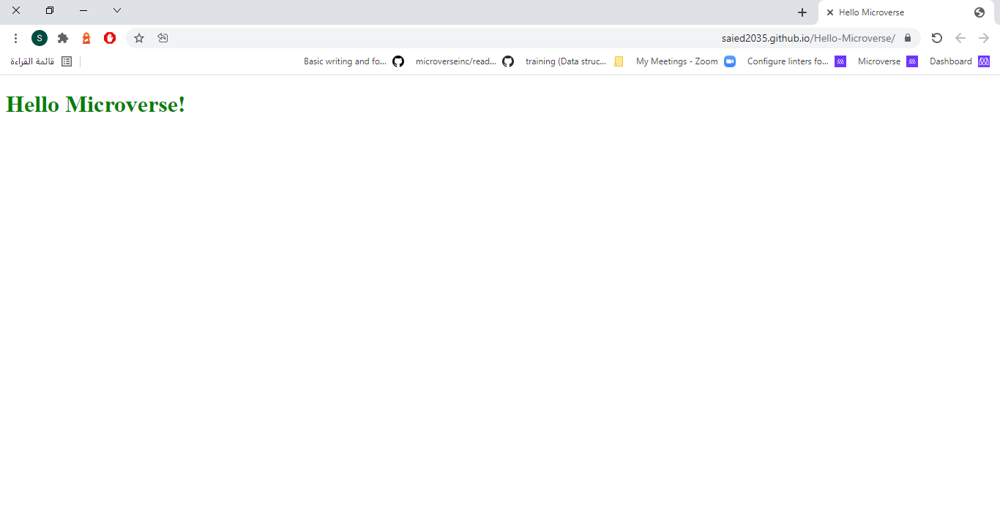

# Hello microverse

> very simple site show "Hello microverse!" phrase

frist project at mcroverse testing linters

## Built With

- HTML
- CSS
- liners for testing

## Live Demo

[Live Demo Link](https://saied2035.github.io/Hello-Microverse/)

## Getting Started

To get a local copy up and running follow these simple example steps.

### Install
 
 after cloning the repo run 
 `npm install`

### Usage
   run 
   `python -m server.http`
### Run tests
   `npx hint .` for html check. giving hints about what is needed to and to your html page
   `npx stylelint "**/*.{css,scss}"` for css check
   `npx stylelint "**/*.{css,scss}" --fix` to fix css isues if found

## Authors

👤 **Saied Gaffer**

- GitHub: [@Saied2035](https://github.com/saied2035)
- Twitter: [@SaiedGaffer](https://twitter.com/SaiedGaffer)
- LinkedIn: [LinkedIn](https://www.linkedin.com/in/saiedgaffer/)

## 🤝 Contributing

Contributions, issues, and feature requests are welcome!

Feel free to check the [issues page](https://github.com/saied2035/Hello-Microverse/issues).

## Show your support

Give a ⭐️ if you like this project!

## Acknowledgments

- Microverse: [microverse community](https://github.com/microverseinc)

## 📝 License

This project is [MIT](./MIT.md) licensed.